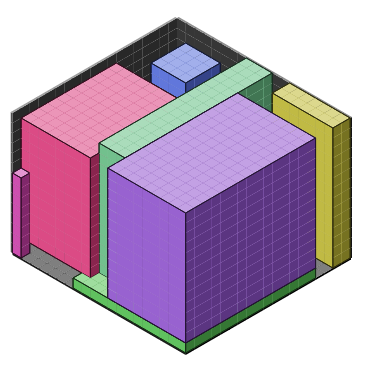
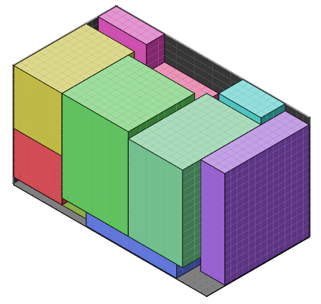

# Truck - Package optimization problem

We've modeled this problem and use a MILP python solver (Pulp)

<table>
  <tr>
    <td colspan="2" style="text-align: center;"><h3>Model specifications</h3></td>
  </tr>
  <tr>
    <td><h4>✅ Can</h4></td>
    <td><h4>❌ Can't</h4></td>
  </tr>
  <tr>
    <td valign="top">
      <ul>
        <b><li>Packages Position</li>
        <li>Parallelepiped Rectangle Packages</li>
        <li>Overlap</li>
        <li>Truck Size</li>
        <li>Maximize Packages amount (weight tunable)</li>
        <li>Maximize Packages size (weight tunable)</li>
        <li>Packages Rotation</li></b>
      </ul>
    </td>
    <td valign="top">
      <ul>
        <b><li>Maximize large empty space</li>
        <li>Levitating packages</li>
        <li>Multiple Trucks</li>
        <li>Delivery order</li>
        <li>Real physics with weight (small package can carry a huge package</li>
        <li>Fragile packages</li>
        <li>Not Parallelepiped Rectangle Packages</li></b>
      </ul>
    </td>
  </tr>
</table>

It also offers a visualization of the output :

